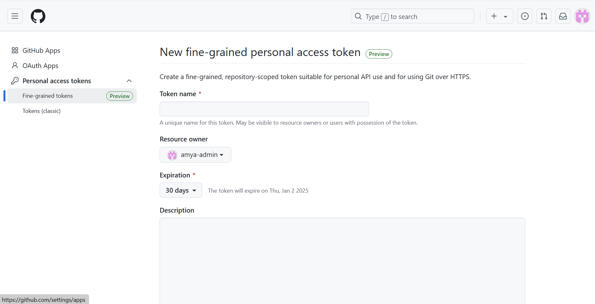

--- 
title: "GitHub Graph connector for Microsoft Search and Copilot" 
ms.author: efgilboa
author: vivg
manager: igala
audience: Admin
ms.audience: Admin 
ms.topic: article 
ms.service: mssearch 
ms.localizationpriority: medium 
search.appverid: 
- BFB160 
- MET150 
- MOE150 
description: "Set up the GitHub Microsoft Graph connector for Microsoft Search and Microsoft 365 Copilot" 
ms.date: 11/11/2024
---

# GitHub Microsoft Graph connector (Preview)

The GitHub Graph Connector allows you to index content from GitHub repositories, making it easily searchable within the Microsoft 365 ecosystem. This connector is ideal for organizations that use GitHub for documentation, project files, or content management. By integrating GitHub data with Microsoft Search, users can access relevant content directly within Microsoft 365 applications, streamlining workflows and reducing the need to switch between platforms. 

This article is for Microsoft 365 administrators or anyone who configures, runs, and monitors a GitHub Graph connector.

>[!NOTE]
>The GitHub Graph connector is in preview. If you wish to get early access to try it, sign up using [this form](https://forms.office.com/r/JniPmK5bzm).

## Capabilities
- Index GitHub repositories and markdown files to make project documentation accessible in Microsoft 365.
- Enable end users to ask questions in Copilot related to project documentation and technical guides.
   - How do I set up Project Alpha?
   - Where can I find the deployment instructions?
   - What is the architecture overview for this project?
   - Summarize key sections in project documentation for quick reference
- Use [Semantic search in Copilot](semantic-index-for-copilot.md) to enable users to find relevant content based on keywords, personal preferences, and social connections.

## Limitations
- Only repository metadata and markdown files are indexed. Other GitHub entities such as issues, pull requests, and comments aren't indexed.
- Only markdown files up to 1 MB in size are supported. Larger files aren't indexed.

## Prerequisites
- You must be the **search admin** for your organization's Microsoft 365 tenant.
- You must have an active GitHub account where you have access to all the repositories you intend to index.
 
   a. For personal repositories, you must be one of:
   - A repository owner
   - A repository collaborator

   b. For organization-owned repositories, you must be one of: 
    - An outside collaborator 
    - An organization member as a direct collaborator
    - An organization member with access through team memberships 
    - An organization member with access through default organization permissions 
    - An organization owner.
- You must have a personal access token (PAT). To learn more about the personal access tokens, see [Managing your personal access tokens - GitHub Docs](https://docs.github.com/authentication/keeping-your-account-and-data-secure/managing-your-personal-access-tokens).
- Your personal access token must have access to all repositories you want to index and must be granted the permission listed below.

   For classic token: 

     | Category | Permission | Remarks |
     | ------------ | ------------ | ------------ |
     | Repo | All | Full control of private repositories |
     | User  | read:user  | Read ALL user profile data |
     | User  | read:email  | Access user email addresses (read-only) |

   For the fine-grained token:

     | Category | Permission | Permission Level |
     | ------------ | ------------ | ------------ |
     | Repository Permissions | Contents | Read-only |
     | Repository Permissions | Metadata | Read-only |
     | Account Permissions | Email addresses | Read-only |

- If you have organization-owned repositories, follow these extra steps:
   - The organization administrator needs to allow access via personal access tokens. For instructions, see [Setting a personal access token policy for your organization - GitHub Docs](https://docs.github.com/organizations/managing-programmatic-access-to-your-organization/setting-a-personal-access-token-policy-for-your-organization#restricting-access-by-personal-access-tokens)
   - If you're using fine-grained tokens, select the organization as the resource owner.

## Get Started

### 1. Display name 
A display name is used to identify each citation in Copilot, helping users easily recognize the associated file or item. Display name also signifies trusted content. Display name is also used as a [content source filter](/MicrosoftSearch/custom-filters#content-source-filters). A default value is present for this field, but you can customize it to a name that users in your organization recognize.

### 2. Authentication Type

To authenticate and sync content from GitHub: 
 
1. **Authentication type**  
Choose the "Basic" option

2. **Personal Access Token (PAT)**  

Use your personal access token in place of a password. The repositories available for indexing depends on the access granted by your token.
 
## Custom Setup

Custom setup is for those admins who want to edit the default values for settings listed. Once you click on the "Custom Setup" option, you see three more tabs - Users, Content, and Sync.

### Users

**Access Permissions**

The GitHub connector supports search permissions visible to **Everyone** with access to this data source. For Everyone, indexed data appears in the search results for all users.
For identity transformation, refer to the [Map your non-Azure AD Identities | Microsoft Learn](map-non-aad.md).
 
### Content

Choose the repositories and file types (initially markdown files and other non-code documentation) you wish to make searchable.

**Manage Properties**

Here, you can add or remove available properties from your GitHub data source, assign a schema to the property (define whether a property is searchable, queryable, retrievable, or refinable), change the semantic label and add an alias to the property.

### Sync

The refresh interval determines how often your data is synced between the data source and the Graph connector index. There are two types of refresh intervals - full crawl and incremental crawl. For more information, see [refresh settings](configure-connector.md#step-8-refresh-settings).

You can change the default values of refresh interval from here if you want to.

## Troubleshooting
After publishing your connection, you can review the status under the **Data Sources** tab in the [admin center](https://admin.microsoft.com). To learn how to make updates and deletions, see [Manage your connector](manage-connector.md). 

If you have issues or want to provide feedback, contact [Microsoft Graph | Support](https://developer.microsoft.com/en-us/graph/support).
