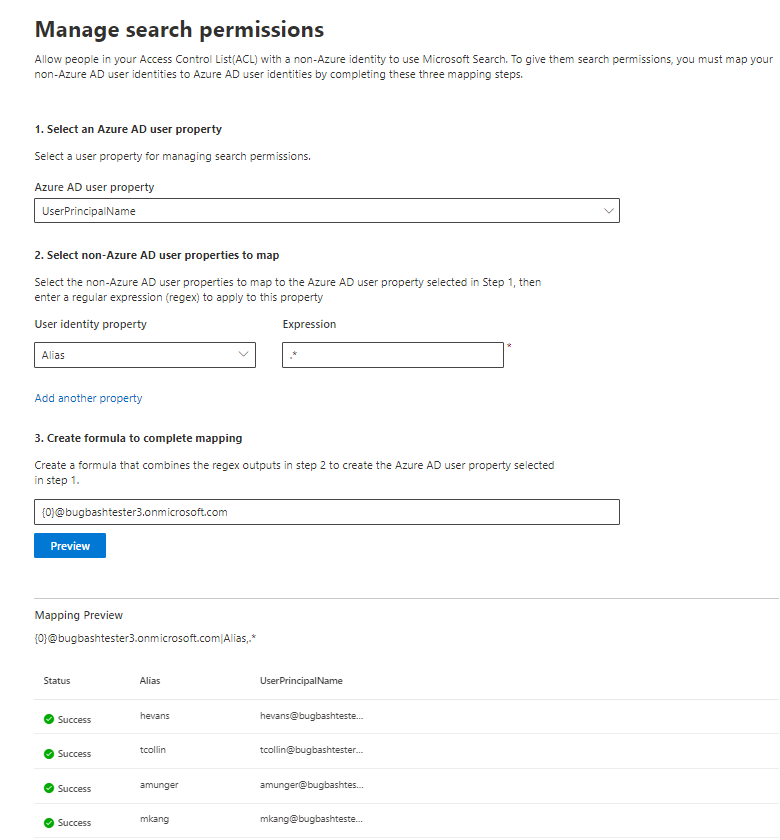

# Map your non-Azure AD Identities  

This article walks you through the steps of mapping your non-Azure AD identities to your Microsoft Entra identities so that people in your Access Control List (ACL) with non-Azure AD identities can see connector search results scoped to them.

These steps are only relevant to search administrators who are setting up a [Confluence Cloud](confluence-cloud-connector.md), [Confluence On-premises](confluence-onpremises-connector.md), [ServiceNow Knowledge](servicenow-knowledge-connector.md), [ServiceNow Catalog](servicenow-catalog-connector.md),
[ServiceNow Tickets](servicenow-tickets-connector.md) or [Salesforce](salesforce-connector.md) connectors by Microsoft with search permissions for "Only people with access to this data source" and identity type "Non-AAD."

>[!NOTE]
>If you are setting up a Salesforce connector and select **Only people with access to this data source** and identity type **Microsoft Entra ID** on the search permissions screen, refer to the [Map your Microsoft Entra identities](map-aad.md) article for steps on how to map Microsoft Entra identities.  

## Steps for mapping your non-Azure AD properties

### 1. Select a Microsoft Entra user property  

You can select the Microsoft Entra user property you're creating the mapping for. This is the target property you're aiming to map your non-Azure AD identities to.  

You can select one of the following Microsoft Entra properties:

| Microsoft Entra property    | Definition           | Example         |
| :------------------- | :------------------- |:--------------- |
| User Principal Name (UPN)  | A UPN consists of a UPN prefix (the user account name) and a UPN suffix (a DNS domain name). The prefix is joined with the suffix using the "@" symbol. | us1@contoso.onmicrosoft.com |
| Microsoft Entra ID                 | A Microsoft Entra ID for a given user is the unique GUID of the user.                 | 58006c96-9e6e-45ea-8c88-4a56851eefad            |
| Active Directory Security ID (SID)                  | SID (Security Identifier) is a unique identifier that Active Directory uses to identify objects as security principal.                  | S-1-5-21-453406510-812318184-4183662089             |

### 2. Select non-Azure AD user properties to map

You can select non-Azure AD properties pulled from your data source to apply regular expressions on. To learn more about where to find these properties in your data source, see the [Confluence Cloud](confluence-cloud-connector.md), [Confluence On-premises](confluence-onpremises-connector.md), [ServiceNow Knowledge](servicenow-knowledge-connector.md), [ServiceNow Catalog](servicenow-catalog-connector.md), [ServiceNow Tickets](servicenow-tickets-connector.md) and [Salesforce](salesforce-connector.md) pages.  

You can select a non-Azure AD user property from the dropdown and provide a regular expression to be applied on those user property values.

Following are some examples of regular expressions and their outputs applied to a sample string: 

| Sample String                  | Regular expression                 | Output of regular expression on sample string           |
| :------------------- | :------------------- |:---------------|
| Alexis Vasquez  | .* | Alexis Vasquez |
| Alexis Vasquez                 | ..$                 | ez            |
| Alexis Vasquez                  | (\w+)$                  | Vasquez             |

You can add as many non-Azure AD user properties as you would like expressions for. You can apply different regular expressions to the same user property if your final formula warrants that.  

### 3. Create formula to complete mapping

You can combine the outputs of the regular expressions applied to each of your non-Azure AD user properties to form the Microsoft Entra property selected in step 1.

In the formula box, "{0}" corresponds to the output of the regular expression applied to the *first* non-Azure AD property you selected. "{1}" corresponds to the output of the regular expression applied to the *second* non-Azure AD property you selected. "{2}" corresponds to the output of the regular expression applied to the *third* non-Azure AD property, and so on.  

Following are some examples of formulas with sample regular expression outputs and formula outputs: 

| Sample formula                  | Value of {0} on sample user                 | Value of {1} on sample user           | Output of formula                  |
| :------------------- | :------------------- |:---------------|:---------------|
| {0}.{1}@contoso.com  | firstname | lastname |firstname.lastname@contoso.com
| {0}@domain.com                 | userid                 |             |userid@domain.com

After you provide your formula, you can optionally click **Preview** to see a preview of 5 random users from your data source with their respective user mappings applied. The output of the preview includes the value of the non-Azure AD user properties selected in step 2 for those users and the output of the final formula provided in step 3 for that user. It also indicates whether the output of the formula could be resolved to a Microsoft Entra user in your tenant via a "Success" or "Failed" icon.  

>[!NOTE]
>You can still proceed with creating your connection if one or more user mappings have a "Failed" status after you click **Preview**. The preview shows 5 random users and their mappings from your data source. If the mapping you provide does not map all users, you may experience this case.

## Sample non-Azure AD mapping

See the snapshot below for a sample non-Azure AD mapping.

## Limitations  

- Only one mapping is supported for all users. Conditional mappings aren't supported.  

- You can't change your mapping once the connection is published.  

- Only regex-based expressions against the non-AAD user properties are currently supported for the transformation.

- There are only 3 Microsoft Entra identities you can choose to map to (UPN, Microsoft Entra ID, and AD SID).
