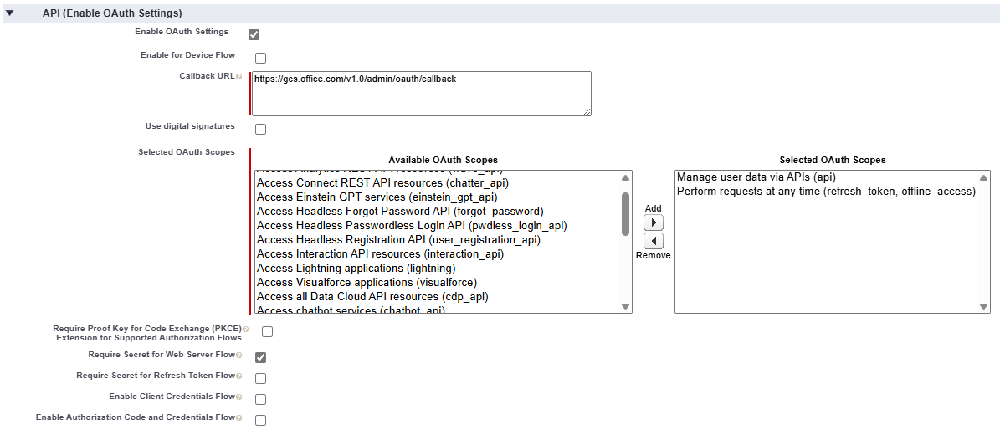
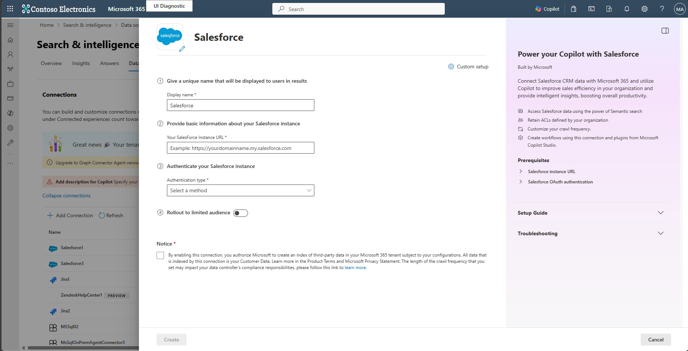
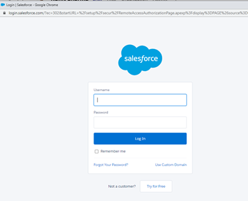
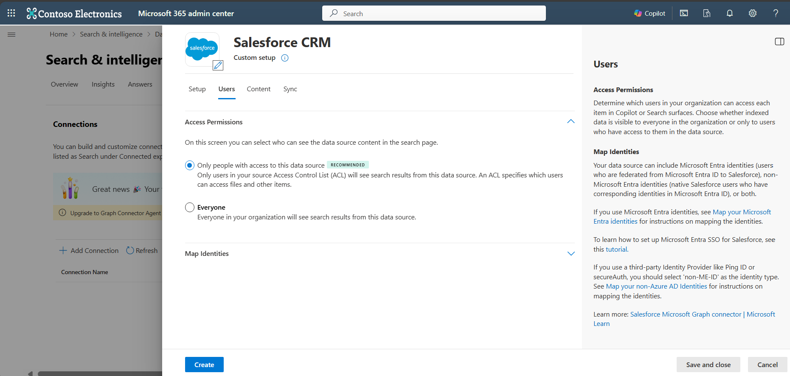
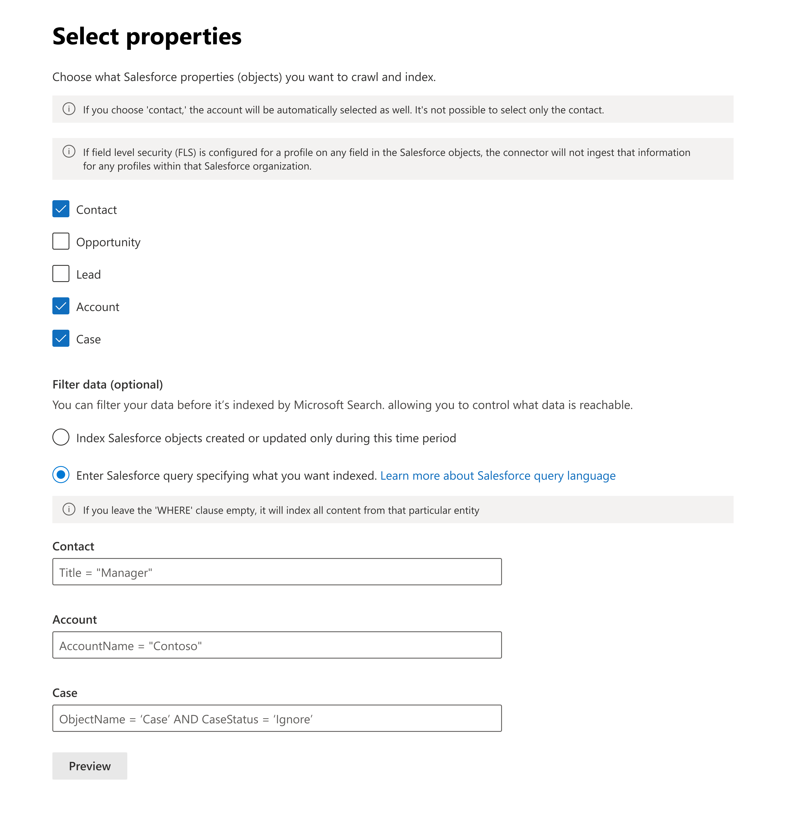

<!---Previous ms.author: rusamai --->

# Salesforce CRM Microsoft Graph connector

The Salesforce Microsoft Graph connector, allows your organization to index contacts, opportunities, leads, cases, and accounts objects in your Salesforce instance. After you configure the connector and index content from Salesforce, end users can search for those items from any Microsoft Search and Microsoft 365 Copilot client.

This article is for Microsoft 365 administrators or anyone who configures, runs, and monitors a Salesforce CRM Microsoft Graph connector.

>[!IMPORTANT]
>The Salesforce Microsoft Graph connector currently supports Summer '19 or later.

## Capabilities

- Index contacts, opportunities, leads, cases, and accounts objects in your Salesforce instance
- Filter content basis what you want to index  
-	Access Salesforce CRM data using the power of Semantic search
-	Retain ACLs defined by your organization
-	Customize your crawl frequency
-	Create agents and workflows using this connection and plugins from Microsoft Copilot Studio

## Limitations

- The Salesforce Microsoft Graph connector doesn't currently support Apex-based, territory-based sharing and sharing using personal groups from Salesforce.
- There's a known bug in the Salesforce API the connector uses, where the private org-wide defaults for leads aren't honored currently.  
- If a field has field level security (FLS) set for a profile, the connector won't ingest that field for any profiles in that Salesforce org. As a result, users won't be able to search for values for those fields or  show up in the results.  
- In the manage schema screen these common standard property names are listed once, the options are **Query**, **Search**, **Retrieve**, and **Refine**, and apply to all or none.
    - Name
    - Url
    - Description
    - Fax
    - Phone
    - MobilePhone
    - Email
    - Type
    - Title
    - AccountId
    - AccountName
    - AccountUrl
    - AccountOwner
    - AccountOwnerUrl
    - Owner
    - OwnerUrl
    - CreatedBy
    - CreatedByUrl
    - LastModifiedBy
    - LastModifiedByUrl
    - LastModifiedDate
    - ObjectName

## Prerequisites

To connect to your Salesforce instance, you need your Salesforce instance URL, the client ID, and the client secret for OAuth authentication. The following steps explain how you or your Salesforce administrator can get this information from your Salesforce account:

- Log in to your Salesforce instance and go to Setup

- Navigate to Apps -> App Manager.

- Select **New connected app**.

- Complete the API section as follows:

    - Select the checkbox for **Enable Oauth settings**.

    - Specify the Callback URL as: For **M365 Enterprise**: `https://gcs.office.com/v1.0/admin/oauth/callback`, for **M365 Government**: `https://gcsgcc.office.com/v1.0/admin/oauth/callback`

    - Select these required OAuth scopes.

        - Access and manage your data (API).

        - Perform requests on your behalf at any time (refresh_token, offline_access).

    - Select the checkbox for **Require secret for web server flow**.

    - Save the app.
    
      > [!div class="mx-imgBorder"]
      > 

- Copy the consumer key and the consumer secret. This information is used as the client ID and the client secret when you configure the connection settings for your Salesforce Microsoft Graph connector in the Microsoft 365 admin portal.

  > [!div class="mx-imgBorder"]
  > 
  
- Before closing your Salesforce instance, follow these steps to ensure that refresh tokens don't expire:
    - Go to Apps -> App Manager.
    - Find the app you created and select the drop-down on the right. Select **Manage**.
    - Select **edit policies**.
    - For the refresh token policy, select **Refresh token is valid until revoked**.

  > [!div class="mx-imgBorder"]
  > 

You can now use the [Microsoft 365 Admin Center](https://admin.microsoft.com/) to complete the rest of the setup process for your Microsoft Graph connector.

## Get Started

### 1. Display name

A display name is used to identify each reference in Copilot, helping users easily recognize the associated file or item. Display name also signifies trusted content. Display name is also used as a [content source filter](/MicrosoftSearch/custom-filters#content-source-filters). A default value is present for this field, but you can customize it to a name that users in your organization recognize.

### 2. Salesforce CRM URL

For the Instance URL, use https://[domain].my.salesforce.com where the domain would be the Salesforce domain for your organization.

### 3. Authentication Type

To authenticate and sync content from Salesforce CRM, choose **OAuth 2.0**.  Enter the client ID and client Secret you obtained from your Salesforce instance and select Authorize.

The first time you've attempted to sign in with these settings, you'll get a pop-up asking you to log in to Salesforce with your admin username and password. The screenshot below shows the popup. Enter your credentials and select "Log In".

  

  >[!NOTE]
  >
  > - If the pop-up does not appear, it might be getting blocked in your browser, so you must allow pop-ups and redirects.
  > - Ensure that the Salesforce account being used to log in for the Graph connector is the same as the user already logged into Salesforce.
  > - Ensure the user logging in has all the necessary object permissions for the organization.

Check that the connection was successful by looking for a green tick that shows correct credentials as shown in the screenshot below.

  > [!div class="mx-imgBorder"]
  > 

### 4. Roll out to limited audience

Deploy this connection to a limited user base if you want to validate it in Copilot and other Search surfaces before expanding the rollout to a broader audience. To know more about limited rollout, see [staged rollout](staged-rollout-for-graph-connectors.md).

At this point, you're ready to create the connection for Salesforce CRM. You can click **Create** to publish your connection and index content from your Salesforce instance.

For other settings, like **Access Permissions**, **Data Inclusion Rules**, **Schema**, **Crawl frequency**, etc., we have defaults based on what works best with Jira data. You can see the default values below:

| Users | Description |
|----|---|
| Access permissions | _Only people with access to content in Data source._ |
| Map Identities | _Data source identities mapped using Microsoft Entra IDs._ |

| Content | Description |
|---|---|
| Salesforce objects | _All objects are indexed._ |
| Filter data | _All objects are indexed. No time filter or [SOQL](https://developer.salesforce.com/docs/atlas.en-us.soql_sosl.meta/soql_sosl/sforce_api_calls_soql_select_conditionexpression.htm) criteria is applied._ |
| Manage Properties | _To check default properties and their schema, see [content](#content)._ |

| Sync | Description |
|---|---|
| Incremental Crawl | _Frequency: Every 15 mins_ |
| Full Crawl | _Frequency: Every Day_ |

If you want to edit any of these values, you need to choose the "Custom Setup" option.

## Custom Setup

Custom setup is for those admins who want to edit the default values for settings listed in the above table. Once you click on the "Custom Setup" option, you see three more tabs - Users, Content, and Sync.

### Users

**Access Permissions**

The Salesforce CRM connector supports search permissions visible to **Everyone** or **Only people with access to this data source**. If you choose **Everyone**, indexed data will appear in the search results for all users. If you choose **Only people with access to this data source**, indexed data will appear in the search results for users who have access to them. Choose the one that is most appropriate for your organization.

**Mapping Identities**

You can choose to ingest Access Control Lists (ACLs) from your Salesforce instance or allow everyone in your organization to see search results from this data source. ACLs can include Microsoft Entra identities (users who are federated from Microsoft Entra ID to Salesforce), non-Azure AD identities (native Salesforce users who have corresponding identities in Microsoft Entra ID), or both.

>[!NOTE]
>If you use a third-party Identity Provider like Ping ID or secureAuth, you should select "non-Microsoft Entra" as the identity type.

If you chose to ingest an ACL from your Salesforce instance and selected "non-ME ID" for the identity type, see [Map your non-Microsoft Entra Identities](map-non-aad.md) for instructions on mapping the identities.

If you chose to ingest an ACL from your Salesforce instance and selected "ME-ID" for the identity type, see [Map your Microsoft Entra Identities](map-aad.md) for instructions on mapping the identities. To learn how to set up Microsoft Entra SSO for Salesforce, see this [tutorial](/azure/active-directory/saas-apps/salesforce-tutorial).

>[!NOTE]
>
> Updates to groups governing access permissions are synced in full crawls only. Incremental crawls don't support processing of updates to permissions.

In this video, you can see the process to authenticate to your Salesforce instance, sync your non-Microsoft Entra identities to your Microsoft Entra identities, and apply the proper security trimmings to your Salesforce items.

> [!VIDEO https://www.youtube-nocookie.com/embed/SZYiFxZMKcM]

### Content

**Choose Salesforce objects and filter data**

Select the Salesforce objects that you want the connector to crawl and include in search results. If Contact is selected, Account is automatically selected as well.

>[!NOTE]
>If a field has field level security (FLS) set for a profile, the connector won't ingest that field for any profiles in that Salesforce org. As a result, users won't be able to search for values for those fields or show up in the results.

_Filter data_

   You may further choose to filter the Salesforce content that are indexed in two ways:

   * Specify the item **modified time period**. This option will only index the Salesforce content that are created or modified in the time period selected on a **rolling basis** based on current crawl.
   * Enter the Salesforce query ([SOQL](https://developer.salesforce.com/docs/atlas.en-us.soql_sosl.meta/soql_sosl/sforce_api_calls_soql_select_conditionexpression.htm)) specifying what you want to index using the **WHERE** clause.

  > [!div class="mx-imgBorder"]
  > 

   > [!TIP]
   > You may leave the **WHERE** clause empty if you want to index all the content of the particular entity

**Manage Properties**

Here, you can add or remove available properties from your Salesforce CRM data source, assign a schema to the property (define whether a property is searchable, queryable, retrievable, or refinable), change the semantic label and add an alias to the property. While this step is not mandatory, having some property labels improves the relevance and ensures better results for end users. By default, some of the Labels like "Title," "URL," "CreatedBy," and  "LastModifiedBy" have already been assigned source properties. Properties that are selected by default are listed below.

*The list of properties that you select here, can impact how you can filter, search, and view your results in Microsoft 365 Copilot.*

**Source property** | **Label** | **Description**
--- | --- | ---
Authors   | `authors` | Name of people who participated/collaborated on the item in the data source.
CreatedBy   | `createdBy` | Name of the person who created the item in the data source.
CreatedDate   | `createdDateTime` | Date and time that the item was created in the data source.
Url  | `url` | The target URL of the item in the data source.
LastModifiedBy   | `lastModifiedBy` | Name of the person who most recently edited the item in the data source.
LastModifiedDateTime  | `lastModifiedDateTime` | Date and time the item was last modified in the data source.
Name   | `title` | The title of the item that you want to show in search and other experiences.

**Preview Data**

Use the preview results button to verify the sample values of the selected properties and query filter.

### Sync

The refresh interval determines how often your data is synced between the data source and the Graph connector index. There are two types of refresh intervals - full crawl and incremental crawl. For more details, see [refresh settings](configure-connector.md#step-8-refresh-settings).

You can change the default values of refresh interval from here if you want to.

>[!TIP]
>**Default result type**
>* The Salesforce connector automatically registers a [result type](./customize-search-page.md#step-2-create-result-types) once the connector is published. The result type uses a dynamically generated [result layout](./customize-results-layout.md) based on the fields selected in step 3.
>* You can manage the result type by navigating to [**Result types**](https://admin.microsoft.com/Adminportal/Home#/MicrosoftSearch/resulttypes) in the [Microsoft 365 admin center](https://admin.microsoft.com). The default result type is named "`ConnectionId`Default". For example, if your connection ID is `Salesforce`, your result layout is named: "SalesforceDefault".
>* Also, you can choose to create your own result type if needed.
<!---If the above phrase does not apply, delete it and insert specific details for your data source that are different from general setup instructions.-->

<!---## Troubleshooting-->
<!---Insert troubleshooting recommendations for this data source-->

## Troubleshooting
After publishing your connection, you can review the status under the **Data Sources** tab in the [admin center](https://admin.microsoft.com). To learn how to make updates and deletions, see [Manage your connector](manage-connector.md). 

You can find troubleshooting steps for commonly seen issues [here](troubleshoot-salesforce-connector.md).

If you have issues or want to provide feedback, contact [Microsoft Graph | Support](https://developer.microsoft.com/en-us/graph/support).
