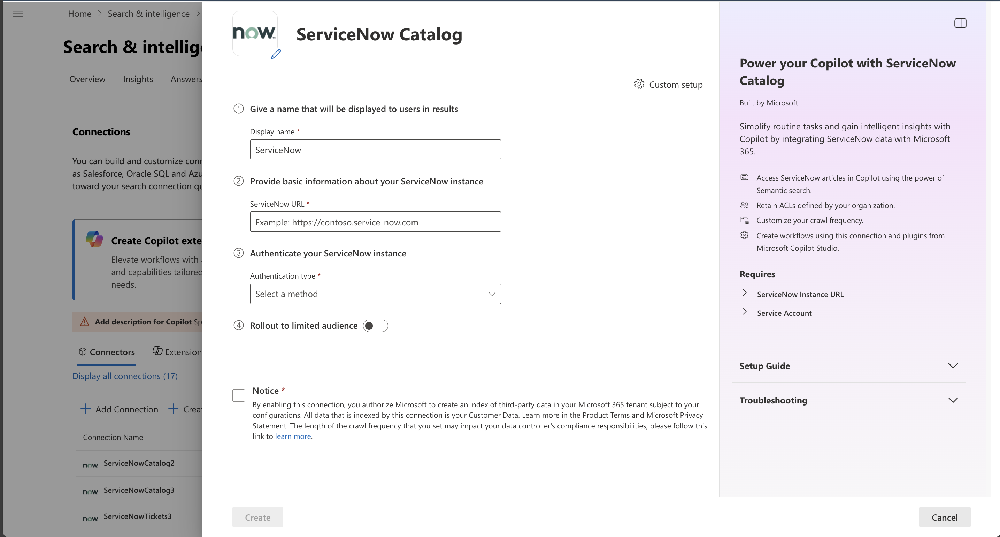
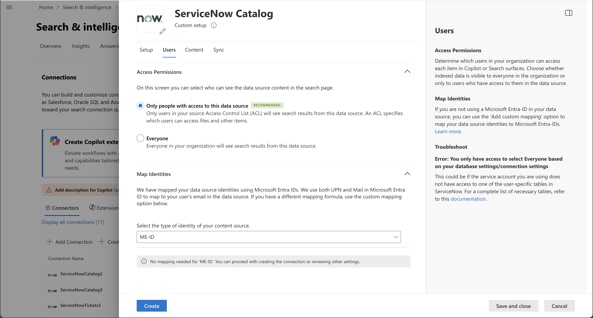
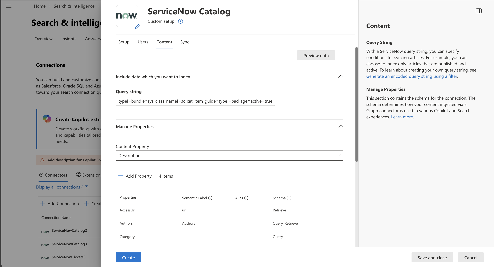
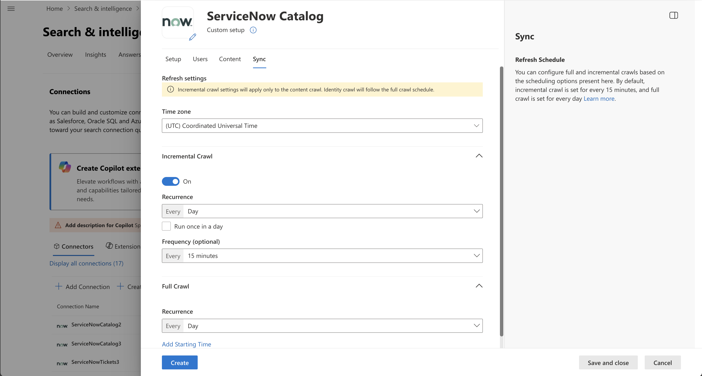

<!---Previous ms.author: kam1 --->

# ServiceNow Catalog Microsoft Graph connector

With the Microsoft Graph connector for ServiceNow, your organization can list [service catalog](https://www.servicenow.com/products/it-service-automation-applications/service-catalog.html) items that are visible to all users or restricted with user criteria permissions within your organization. After you configure the connector and index content from ServiceNow, end users can search for those catalog items in Microsoft Copilot and from any Microsoft Search client.

This article is for Microsoft 365 administrators or anyone who configures, runs, and monitors a ServiceNow Catalog Microsoft Graph  connector. It supplements the general instructions provided in the [Set up Microsoft Graph connectors in the Microsoft 365 admin center](configure-connector.md) article. If you haven't already done so, read the entire Set-up your Microsoft Graph connector article to understand the general setup process.

## Capabilities
- Index all types of Catalog items.
- Enable your end users to ask questions related to your IT/HR workflows in Copilot.
   - Help me request a new device.
   - Help me reset my password.
- Use [Semantic search in Copilot](/MicrosoftSearch/semantic-index-for-copilot) to enable users to find relevant content based on keywords, personal preferences, and social connections.

## Limitations

ServiceNow Catalog Microsoft Graph connector has the following limitations in its latest release:

- User criteria permissions configured at catalog category aren't supported.
- User criteria with advanced scripts aren't supported in the current version.

## Prerequisites
- **ServiceNow Instance URL**: To connect to your ServiceNow data, you need your organization's ServiceNow instance URL. Your organization's ServiceNow instance URL typically looks like `https://your-organization-name.service-now.com`. (Don’t have one? [Take a look at this YouTube video on how to create a test instance](https://www.youtube.com/watch?v=OTdzVLqpFHY)).
- **Service Account**: To connect to ServiceNow and allow Microsoft Graph Connector to update catalog items regularly, you need a service account with read access to specific ServiceNow table records. The service account needs read access to the following **ServiceNow table records** to successfully crawl various entities.

Feature | Read access required tables | Description
--- | --- | ---
Index catalog items available to <em>Everyone</em> | sc_cat_item | For crawling catalog items
Index and support user criteria permissions | sc_cat_item_user_criteria_mtom | Who can access this catalog item
| | sc_cat_item_user_criteria_no_mtom | Who can't access this catalog item
| | sys_user | Read user table
| | sys_user_has_role | Read role information of users
| | sys_user_grmember | Read group membership of users
| | user_criteria | Read user criteria permissions
| | sys_user_group | Read user group segments
| | sys_user_role | Read user roles
| | cmn_location | Read location information
| | cmn_department | Read department information
| | core_company | Read company attributes

You can **create and assign a role** for the service account you use to connect with Microsoft Search. [Learn how to assign role for ServiceNow accounts](https://www.servicenow.com/docs/bundle/xanadu-platform-administration/page/administer/users-and-groups/task/t_AssignARoleToAUser.html). Read access to the tables can be assigned on the created role. To learn about setting read access to table records, see [Granting Table Access to a User in ServiceNow](/MicrosoftSearch/granting-table-access-servicenow.md).

## Get started

[Add ServiceNow Catalog connector](https://admin.microsoft.com/adminportal/home#/MicrosoftSearch/Connectors/add?ms_search_referrer=MicrosoftSearchDocs_ServiceNowCatalog&type=ServiceNowCatalog​)

[](media/servicenow-catalog-create-page.png#lightbox)

### 1. Display name

A display name is used to identify each reference in Copilot, helping users easily recognize the associated file or item. Display name also signifies trusted content. Display name is also used as a [content source filter](/MicrosoftSearch/custom-filters#content-source-filters). A default value is present for this field, but you can customize it to a name that users in your organization recognize.


### 2. ServiceNow URL

To connect to your ServiceNow data, you need your organization's ServiceNow instance URL. Your organization's ServiceNow instance URL typically looks like `https://your-organization-name.service-now.com`.

### 3. Authentication type

To authenticate and sync content from ServiceNow, choose **one of three** supported methods:

1. **Basic authentication**

   Enter the username and password of ServiceNow account with **catalog** role to authenticate to your instance.

1. **ServiceNow OAuth**

   <br/>
   <details>
   <summary>[Click to expand] To use the ServiceNow OAuth for authentication, follow these steps.</summary>
    
   A ServiceNow admin needs to provision an endpoint in your ServiceNow instance, so that the ServiceNow Catalog Microsoft Graph connector can access it. To learn more, see [Create an endpoint for clients to access the instance](https://docs.servicenow.com/bundle/xanadu-platform-security/page/administer/security/task/t_CreateEndpointforExternalClients.html) in the ServiceNow documentation.

   The following table provides guidance on how to fill out the endpoint creation form:

   Field | Description | Recommended value
   --- | --- | ---
   Name | Unique value that identifies the application that you require OAuth access for. | Microsoft Search
   Client ID | A read-only, auto-generated unique ID for the application. The instance uses the client ID when it requests an access token. | NA
   Client secret | With this shared secret string, the ServiceNow instance and Microsoft Search authorize communications with each other. | Follow security best practices by treating the secret as a password.
   Redirect URL | A required callback URL that the authorization server redirects to. | For **M365 Enterprise**: https://<span>gcs.office.</span>com/v1.0/admin/oauth/callback,</br> For **M365 Government**: https://<span>gcsgcc.office.<span>com/v1.0/admin/oauth/callback
   Logo URL | A URL that contains the image for the application logo. | NA
   Active | Select the check box to make the application registry active. | Set to active
   Refresh token lifespan | The number of seconds that a refresh token is valid. By default, refresh tokens expire in 100 days (8,640,000 seconds). | 31,536,000 (one year)
   Access token lifespan | The number of seconds that an access token is valid. | 43,200 (12 hours)
   
   Enter the client ID and client secret to connect to your instance. After connecting, use a ServiceNow account credential to authenticate permission to crawl. The account should at least have **catalog** role. Refer to the table mentioned under the Service account in the [Prerequisites](#prerequisites) section for providing read access to more ServiceNow table records and index user criteria permissions.
   </details>

1. **Microsoft Entra ID OpenID Connect**

   <br/>
   <details>
   <summary>To use Microsoft Entra ID OpenID Connect for authentication, follow the steps below.</summary>
   <a name='step-331-register-a-new-application-in-azure-active-directory'></a>

   1. Register a new application in Microsoft Entra ID

      To learn about registering a new application in Microsoft Entra ID, see [Register an application](/azure/active-directory/develop/quickstart-register-app#register-an-application). Select single tenant organizational directory. Redirect URI isn't needed. After registration, note down the Application (client) ID and Directory (tenant) ID.

   2. Create a client secret

      To learn about creating a client secret, see [Creating a client secret](/azure/active-directory/develop/quickstart-register-app#add-a-client-secret). Take a note of client secret.

   3. Retrieve Service Principal Object Identifier

      Follow the steps to retrieve Service Principal Object Identifier

      1. Run PowerShell.

      1. Install Azure PowerShell using the following command.

         ```powershell
         Install-Module -Name Az -AllowClobber -Scope CurrentUser
         ```

      1. Connect to Azure.

         ```powershell
         Connect-AzAccount
         ```

      1. Get Service Principal Object Identifier.

         ```powershell
         Get-AzADServicePrincipal -ApplicationId "Application-ID"
         ```
   
         Replace "Application-ID" with Application (client) ID (without quotes) of the application you registered in step 1. Note the value of ID object from PowerShell output. It's the Service Principal ID.

         Now you have all the information required from Azure portal. A quick summary of the information is given in the table below.

         Property | Description
         --- | ---
         Directory ID (Tenant ID) | Unique ID of the Microsoft Entra tenant, from step 3.a.
         Application ID (Client ID) | Unique ID of the application registered in step 3.a.
         Client Secret | The secret key of the application (from step 3.b). Treat it like a password.
         Service Principal ID | An identity for the application running as a service. (from step 3.c)

   4. Register the ServiceNow Application

      The ServiceNow instance needs the following configuration:

         1. Register a new OAuth OIDC entity. To learn, see [Create an OAuth OIDC provider](https://docs.servicenow.com/bundle/xanadu-platform-security/page/administer/security/task/add-OIDC-entity.html).

         1. The following table provides guidance on how to fill out OIDC provider registration form:

            Field | Description | Recommended Value
            --- | --- | ---
            Name | A unique name that identifies the OAuth OIDC entity. | Microsoft Entra ID
            Client ID | The client ID of the application registered in the third-party OAuth OIDC server. The instance uses the client ID when requesting an access token. | Application (Client) ID from step 3.a
            Client Secret | The client secret of the application registered in the third-party OAuth OIDC server. | Client Secret from step 3.b

            All other values can be default.

         1. In the OIDC provider registration form, you need to add a new OIDC provider configuration. Select the search icon against *OAuth OIDC Provider Configuration* field to open the records of OIDC configurations. Select **New**.

         1. The following table provides guidance on how to fill out OIDC provider configuration form:

            Field | Recommended Value
            --- | ---
            OIDC Provider |  Microsoft Entra ID
            OIDC Metadata URL | The URL must be in the form https\://login.microsoftonline.com/<tenandId">/.well-known/openid-configuration <br/>Replace "tenantID" with Directory (tenant) ID from step 3.1.
            OIDC Configuration Cache Life Span |  120
            Application | Global
            User Claim | sub
            User Field | User ID
            Enable JTI claim verification | Disabled

         1. Select **Submit** and update the OAuth OIDC Entity form.

   5. Create a ServiceNow account.

      Refer to the instructions to create a ServiceNow account, [create a user in ServiceNow](https://docs.servicenow.com/bundle/xanadu-platform-administration/page/administer/users-and-groups/task/t_CreateAUser.html).

      The following table provides guidance on how to fill out the ServiceNow user account registration

      Field | Recommended Value
       --- | ---
      User ID | Service Principal ID from step 3.3 
      Web service access only | Checked

      All other values can be left to default.

   6. Enable catalog role for the ServiceNow account

      Access the ServiceNow account you created with ServiceNow Principal ID as User ID and assign the catalog role. Instructions to assigning a role to a ServiceNow account can be found here, [assign a role to a user](https://docs.servicenow.com/bundle/xanadu-platform-administration/page/administer/users-and-groups/task/t_AssignARoleToAUser.html). Refer to the table in the beginning of [Prerequisites](#prerequisites) for providing read access to more ServiceNow table records and index user criteria permissions.

      Use Application ID as Client ID (from step 3.1), and Client secret (from step 3.2) in admin center configuration assistant to authenticate to your ServiceNow instance using Microsoft Entra ID OpenID Connect.
   </details>

>[!NOTE]
> The ServiceNow Catalog connector can index catalog items and user criteria permissions without advanced scripts.

### 4. Rollout to a limited audience

Deploy this connection to a limited user base if you want to validate it in Copilot and other Search surfaces before expanding the rollout to a broader audience. To know more about limited rollout, click [here](/MicrosoftSearch/staged-rollout-for-graph-connectors).

At this point, you are ready to create the connection for ServiceNow Catalog. You can select the **Create** button and the ServiceNow Catalog Microsoft Graph connector starts indexing catalog items from your ServiceNow account.

For other settings, like Access permissions, Data inclusion rules, Schema, and Crawl frequency, we have set defaults based on what works best with ServiceNow data. You can see the default values below:

| Users |&nbsp;|
|----|---|
|Access permissions|_Only people with access to content in Data source._|
|Map Identities|_Data source identities mapped using Microsoft Entra IDs._|

| Content |&nbsp;|
|---|---|
|Query String|_active=true^workflow_state=published_|
|Manage Properties|_To check default properties and their schema, click here_|

| Sync |&nbsp;|
|---|---|
|Incremental Crawl|_Frequency: Every 15 mins_|
|Full Crawl|_Frequency: Every Day_|

If you want to edit any of these values, you need to choose the **Custom Setup** option.

## Custom setup

Custom setup is for those admins who want to edit the default values for settings listed in the above table. Once you click **Custom Setup**, you see three more tabs: **Users**, **Content**, and **Sync**.

### Users

[](media/servicenow-catalog-users-tab.png#lightbox)

**Access permissions**

The ServiceNow Catalog Microsoft Graph connector supports access permissions visible to "Everyone" or "Only people with access to content in data source". Indexed data appears in results and is visible to all users in the organization or users who have access to them via user criteria permission respectively. Choose the one that is most appropriate for your organization.

The connector supports default user criteria permissions without advanced scripts.

**Mapping identities**

The default method for mapping your data source identities with Microsoft Entra ID is by checking whether the Email id of ServiceNow users is same as the UserPrincipalName (UPN), or Mail of the users in Microsoft Entra ID. If you believe the default mapping would not work for your organization, you can provide a custom mapping formula. To know more about, mapping Non-EntraID identities, click [here](/MicrosoftSearch/map-non-aad).

### Content

[](media/servicenow-catalog-content-tab.png#lightbox)

**Query string**

With a ServiceNow query string, you can specify conditions for syncing articles. It's like a **Where** clause in a **SQL Select** statement. For example, you can choose to index only articles that are published and active. To learn about creating your own query string, see [Generate an encoded query string using a filter](https://docs.servicenow.com/bundle/xanadu-platform-user-interface/page/use/using-lists/task/t_GenEncodQueryStringFilter.html).

**Manage properties**

Here, you can add or remove available properties from your ServiceNow data source, assign a schema to the property (define whether a property is searchable, queryable, retrievable or refinable), change the semantic label, and add an alias to the property. Properties that are selected by default are listed below.

*The list of properties that you select here, can impact how can you filter, search and view your results in Copilot for Microsoft 365.*

**Source property** | **Label** | **Description** | **Schema** |
--- | --- | --- | --- |
AccessUrl  | `url` | The target URL of the item in the data source. | Retrieve |
Authors   | `authors` | Name of people who participated/collaborated on the item in the data source. ||
Catalog || The specific catalog to which the item belongs. | Query |
Category || The category within the catalog. | Query |
Description | `Content` | The description of the catalog item. | Search, Retrieve |
IconUrl   | `iconUrl` | Icon url that represents the article’s category or type. | Retrieve |
Name   | `title` | The title of the item that you want shown in search and other experiences. | Searcb, Retrieve |
Short Description || A brief summary of the item's purpose. | Search, Retrieve |
SysCreatedBy   | `createdBy` | Name of the person who created the item in the data source. | Query, Retrieve |
SysCreatedOn   | `createdDateTime` | Date and time that the item was created in the data source. | Query, Retrieve |
SysID || Unique identifier for an item. ||
SysUpdatedBy   | `lastModifiedBy` | Name of the person who most recently edited the item in the data source. | Query, Retrieve |
SysUpdatedOn  | `lastModifiedDateTime` | Date and time the item was last modified in the data source. | Query, Retrieve |

**Preview data**

Use the preview results button to verify the sample values of the selected properties and query filter.

### Sync

[](media/servicenow-catalog-sync-tab.png#lightbox)

The refresh interval determines how often your data is synced between the data source and the ServiceNow Catalog Microsoft Graph connector index. There are two types of refresh intervals – full crawl and incremental crawl. For more details, click [here](/MicrosoftSearch/configure-connector#guidelines-for-sync-settings).

You can change the default values of the refresh interval from here if you want to.

## Troubleshooting

After publishing your connection, customizing the results page, you can review the status under the **Data Sources** tab in the [admin center](https://admin.microsoft.com). To learn how to make updates and deletions, see [Manage your connector](manage-connector.md).
You can find troubleshooting steps for commonly seen issues [here](troubleshoot-servicenow-catalog-connector.md).

If you have any other issues or want to provide feedback, reach out to us at [Microsoft Graph | Support](https://developer.microsoft.com/en-us/graph/support)