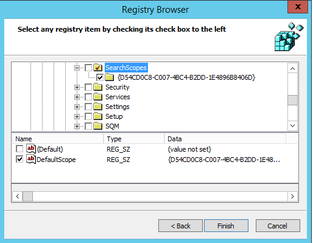

> [!IMPORTANT]
> Beginning March 31, 2025, Office.com and SharePoint will be the new homes for Microsoft Search. Microsoft Search in Bing will no longer be available. We encourage Microsoft Search users to update your bookmarks now.

# Make Bing the default search engine
  
This article explains how you can make Bing the default search engine for Microsoft Edge, Google Chrome, and Internet Explorer. 
  
## Microsoft Edge on Windows 10, Version 1703 or later

Although you'll set Bing as the default search engine, Microsoft Edge allows users to change their settings to use a different search engine.
  
For the latest ADMX files for various versions of Windows, see [How to create and manage the Central Store for Group Policy Administrative Templates in Windows](https://support.microsoft.com/help/3087759/how-to-create-and-manage-the-central-store-for-group-policy-administra).
  
If the setting described in this section cannot be found inside of GPMC, download the appropriate ADMX and copy them to the central store. For more information, see [Editing Domain-Based GPOs Using ADMX Files](/previous-versions/windows/it-pro/windows-vista/cc748955%28v%3dws.10%29). Central store on the controller is a folder with the following naming convention:
 **%systemroot%\sysvol\\<domain\>\policies\PolicyDefinitions**
  
Each domain that your controller handles should get a separate folder. The following command can be used to copy the ADMX file from the command prompt:
  
 `Copy <path_to_ADMX.ADMX> %systemroot%\sysvol\<domain>\policies\PolicyDefinitions`
  
1. Open the Group Policy Management Console (gpmc.msc) and switch to editing an existing policy or creating a new one.
2. Navigate to **&lt;Computer/User Configuration&gt;\Administrative Templates\Windows Components\Microsoft Edge**.
3. Double-click **Set default search engine**, set to **Enabled**, and enter `https://www.bing.com/sa/osd/bfb.xml`
4. Enforce the resultant GPO by linking it to the appropriate domain.

## Google Chrome on Windows 10, Version 1507 or later

Users won't be able to change the default search engine after this policy is set.
  
Chrome comes with its own set of group policy settings which can be downloaded in the form of an ADMX file from [Google Chrome Enterprise Help](https://support.google.com/chrome/a/answer/187202).
  
Copy the template file to a central store for ADMX files on the domain controller. For more information, see [Editing Domain-Based GPOs Using ADMX Files](/previous-versions/windows/it-pro/windows-vista/cc748955%28v%3dws.10%29). Central store on the controller is a folder with the following naming convention:
 **%systemroot%\sysvol\\<domain\>\policies\PolicyDefinitions**
  
Each domain that your controller handles should get a separate folder. The following command can be used to copy the ADMX file from the command prompt:
  
 `Copy <path_to_Chrome.ADMX> %systemroot%\sysvol\<domain>\policies\PolicyDefinitions`
  
1. Open the Group Policy Management Console (gpmc.msc) and switch to editing any existing policy or creating a new one.
2. Make sure the following folders appear in the Administrative Templates section of both User/Computer Configuration: Google Chrome and Google Chrome - Default Settings.

    - The settings of the first section are fixed and local administrators won't be able to change them in the browser.
    - The settings of the latter section of policies can be changed by users in the browser settings.

3. Navigate to **\<Computer/User\> Configuration\Administrative Templates\Google Chrome\Default search provider**
4. Double-click **Enable the default search provider**, and set it to **Enabled**.
5. Double-click **Default search provider icon**, set it to **Enabled**, and enter `https://www.bing.com/sa/simg/bb.ico`
6. Double-click **Default search provider instant URL**, and enter `https://www.bing.com/business/search?q={searchTerms}&amp;form=BFBSPR`
7. Double-click **Default search provider name**, set it to Enabled, and enter 'Microsoft Search in Bing'
8. Double-click **Default search provider search URL**, set it to **Enabled**, and enter `https://www.bing.com/business/search?q={searchTerms}&amp;form=BFBSPR`
9. Enforce the resultant GPO by linking it to the appropriate domain.

## Internet Explorer 11 or later

Users will be able to change the search provider after this policy is set.
  
### STEP 1. Configure the local machine that will be used to set the GPO

Paste the following text into a reg(\*.reg) file.
  
Windows Registry Editor Version 5.00
  
<pre>[HKEY_CURRENT_USER\Software\Microsoft\Internet Explorer\SearchScopes]
"DefaultScope"="{D54CD0C8-C007-4BC4-B2DD-1E4896B8406D}"
[HKEY_CURRENT_USER\Software\Microsoft\Internet Explorer\SearchScopes\{D54CD0C8-C007-4BC4-B2DD-1E4896B8406D}]
"Codepage"=dword:0000fde9
"DisplayName"="Microsoft Search in Bing"
"OSDFileURL"="https://www.bing.com/sa/osd/bfb.xml"
"FaviconURL"="https://www.bing.com/sa/simg/bb.ico"
"URL"="https://www.bing.com/business/search?q={searchTerms}&amp;form=BFBSPR"</pre>
  
Double-click the file created and follow the steps to import the file. A successful import should result in the following dialog:
  

  
### STEP 2. Open the Group Policy Management Console (gpmc.msc) and switch to editing an existing policy or creating a new one

1. Navigate to **User Configuration\Policies\Preferences\Windows Settings**.
2. Right-click on **Registry\New** and select **Registry Wizard**. From the Registry Browser window, select **Local Computer** and click **Next**.
3. Navigate to **HKEY_CURRENT_USER\SOFTWARE\Microsoft\Internet Explorer\SearchScopes**.
4. From this key, make sure to select DefaultScope.

    
5. Check all sub keys containing the GUID for Microsoft Search in Bing and every value under the key except any path to user profiles. Scroll down to select other items.
6. Click Finish to complete this configuration.

### STEP 3. Set up User Preferences to help eliminate a warning the user may get when DefaultScope search is enforced

This warning is by design and alerts users of a program trying to modify their settings.
  
1. Within the same GPO, right click on **Registry\New** and select **Registry Wizard**.
2. Navigate to **HKEY_CURRENT_USER\SOFTWARE\Microsoft\Internet Explorer\User Preferences**.
3. Select the **User Preference** key.
4. Click **Finish**.
5. Click on the newly created object. On the right-side pane double click on the User Preferences object, change the **Action** to **Delete and Save**.
6. Enforce the resultant GPO by linking it to the appropriate domain.