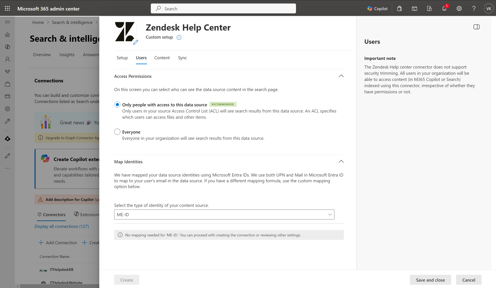
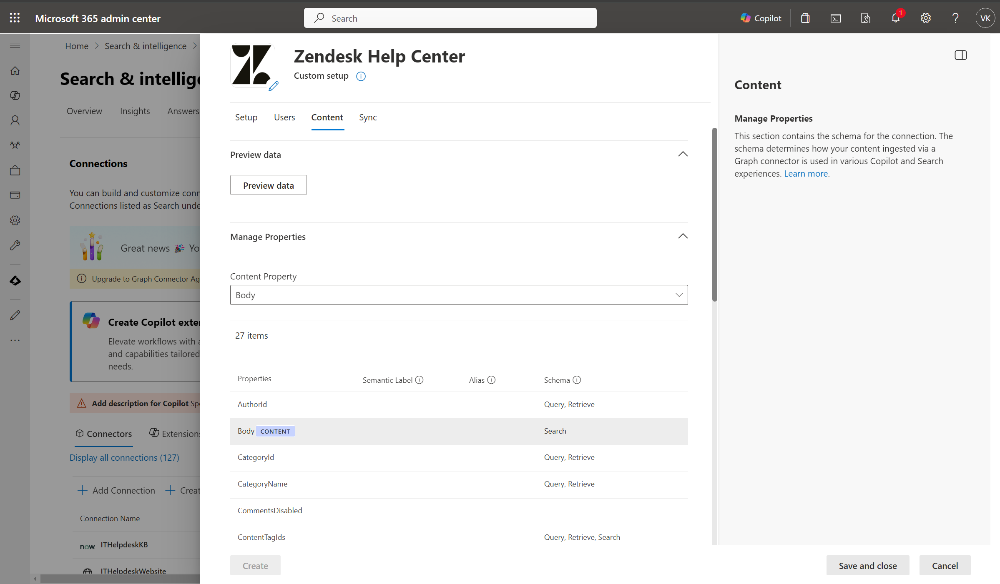
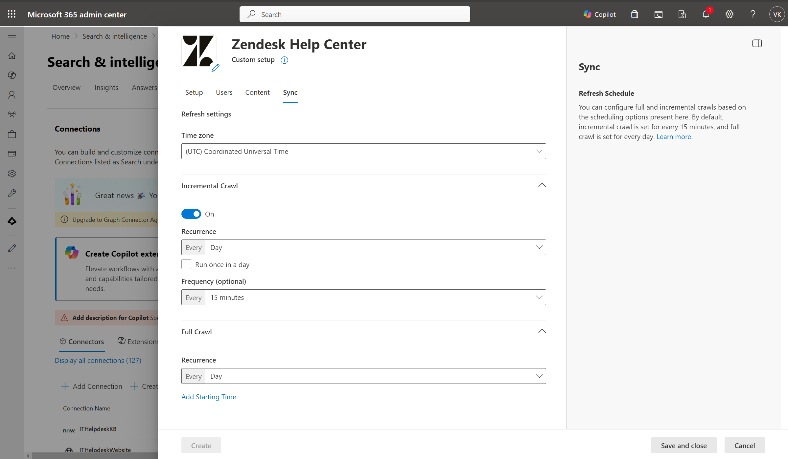

--- 
title: "Zendesk Help Center Graph connector for Microsoft Search and Copilot" 
ms.author: vivg 
author: vivg 
manager: harshkum 
audience: Admin
ms.audience: Admin 
ms.topic: article 
ms.service: mssearch 
ms.localizationpriority: Medium 
search.appverid: 
- BFB160 
- MET150 
- MOE150 
description: "Set up the Zendesk Help Center Microsoft Graph connector for Microsoft Search and Copilot" 
ms.date: 08/30/2024
---

# Zendesk Help Center Microsoft Graph connector (Preview)

The Zendesk Help Center Graph connector allows your organization to index articles from Zendesk Help Center (also known as Zendesk Guide). After you configure the connector, end users can search for these articles from Zendesk in Microsoft Copilot and from any Microsoft Search client.

This article is for Microsoft 365 administrators or anyone who configures, runs, and monitors a Zendesk Help Center Graph connector.

>[!NOTE]
>The Zendesk Help Center connector is in public preview. If you wish to get access to try it, you need to enable [Targeted Release](/microsoft-365/admin/manage/release-options-in-office-365#set-up-the-release-option-in-the-admin-center) ring for your Admin account.

## Capabilities
- Index Help Center articles
- Enable your end users to ask questions related to your support queries or product information in Copilot.
   - What is the return policy for apparels?
   - What are the product specifications for Surface laptop?
   - How can I upgrade my subscription?
- Use [Semantic search in Copilot](semantic-index-for-copilot.md) to enable users to find relevant content based on keywords, personal preferences, and social connections.

## Limitations
- Doesn't support access restrictions to articles based on Zendesk user permissions. All users in your tenant have access to all indexed articles.
- Doesn't index Zendesk Guide Community posts and topics.
- Doesn't index attachments.

## Prerequisites
- You must be the **search admin** for your organization's Microsoft 365 tenant.
- **Zendesk Instance URL**: To connect to your Zendesk Help Center data, you need your organization's Zendesk Help Center instance URL. Your organization's Zendesk Help Center instance URL typically looks like `https://<your-organization-domain>.zendesk.com`. If you don't have an instance already, refer the [article](https://support.zendesk.com/hc/articles/4408823799962-How-do-I-create-a-Support-trial-account) to learn about creating a test instance.
- **Service Account**: To connect to Zendesk Help Center and allow Microsoft Graph Connector to update knowledge articles regularly, you need a service account with read permissions granted to the service account. The service account must have either 'Admin', 'Agent' or 'Light agent' role. The 'Contributor' role does not allow to read permissions in Zendesk. 

## Get Started

### 1. Display name 
A display name is used to identify each citation in Copilot, helping users easily recognize the associated file or item. Display name also signifies trusted content. Display name is also used as a [content source filter](/MicrosoftSearch/custom-filters#content-source-filters). A default value is present for this field, but you can customize it to a name that users in your organization recognize.

### 2. Zendesk URL
To connect to your Zendesk data, you need your organization's Zendesk instance URL. Your organization's Zendesk instance URL typically looks like `https://<your-organization-domain>.zendesk.com`.

### 3. Authentication Type

**Zendesk OAuth**

To use the Zendesk OAuth for authentication, follow these steps.

A Zendesk admin needs to create an OAuth client in the [Zendesk Admin Center](https://support.zendesk.com/hc/articles/4581766374554-Using-Zendesk-Admin-Center). To learn more, see [Managing access to the Zendesk API](https://support.zendesk.com/hc/articles/4408889192858-Managing-access-to-the-Zendesk-API#topic_mmh_gm1_2yb) in the Zendesk documentation.

The following table provides guidance on how to fill out the OAuth client creation form:

Field | Description | Recommended Value
--- | --- | ---
Client name | Unique value that identifies the application that you require OAuth access for. | Microsoft Search
Description | (Optional) A short description of the OAuth client | Use an appropriate description   
Company | The name of your company | Use an appropriate value
Logo | A file that contains the image for the application logo. | Any appropriate logo or use default.
Client kind | Choose between Confidential and Public Oauth client | Confidential
Redirect URL | A required callback URL that the authorization server redirects to. | For **M365 Enterprise**: https://gcs.office.com/v1.0/admin/oauth/callback,  For **M365 Government**: https://gcsgcc.office.com/v1.0/admin/oauth/callback
   
Enter the client ID (Unique identifier) and Secret to connect to your instance. After connecting, use a Zendesk account credential to authenticate permission to crawl.

### 4. Roll out to limited audience
Deploy this connection to a limited user base if you want to validate it in Copilot and other Search surfaces before expanding the rollout to a broader audience. To know more about limited rollout, [click here](staged-rollout-for-graph-connectors.md).

At this point, you're ready to create the connection for Zendesk Help Center. You can click on the "Create" button to publish your connection and index articles from your Zendesk account.

For other settings, like **Access permissions**, **Schema**, and **Crawl frequency**, we have default values based on what works best with Zendesk data.

| Users | Description |
|----|---|
| Access permissions | _Only people with access to content in Data source._ |
| Map Identities | _Data source identities mapped using Microsoft Entra IDs._ |

| Content | Description |
|---|---|
| Manage Properties | _To check default properties and their schema, see [content](#content)_ |

| Sync | Description |
|---|---|
| Incremental Crawl | _Frequency: Every 15 mins_ |
| Full Crawl | _Frequency: Every Day_ |

If you want to edit any of these values, you need to choose the "Custom Setup" option.

## Custom setup

Custom setup is for those admins who want to edit the default values for settings listed in the above table. Once you click on the **Custom Setup** option, you see three more tabs - **Users**, **Content**, and **Sync**.

### Users

**Access permissions**

The Zendesk Help center Microsoft Graph connector supports search permissions visible to **Everyone** or **Only people with access to this data source**. If you choose **Everyone**, indexed data appears in the search results for all users. If you choose **Only people with access to this data source**, indexed data appears in the search results for users who have access to them.

**Mapping identities**

The default method for mapping your data source identities with Microsoft Entra ID is by checking whether the email ID of Zendesk users is the same as the UserPrincipalName (UPN), or Mail of the users in Microsoft Entra. If you believe the default mapping wouldn't work for your organization, you can provide a custom mapping formula. To know more about, mapping Non-Microsoft Entra ID identities, see [Map your non-Azure AD Identities](map-non-aad.md).

To identify which option is suitable for your organization:

1. Choose the **Microsoft Entra ID** option if the Email ID of Zendesk users is the **same** as the UserPrincipalName (UPN) or email of users in Microsoft Entra ID.
2. Choose the **Non-Microsoft Entra ID** option if the Email ID of Zendesk users is **different** from the UserPrincipalName (UPN) and Email of users in Microsoft Entra ID.

### Content

**Manage properties**

Here, you can add or remove available properties from your Zendesk Help center, assign a schema to the property (define whether a property is searchable, queryable, retrievable, or refinable), change the semantic label and add an alias to the property. Properties that are selected by default are listed below.

|Source property|Label|Description|Schema|
|---|---|---|---|
| AuthorId | | Name all the people who participated/collaborated on the item in the data source | Query, Retrieve |
| Body | Content | The main body of the article| Search |
| CategoryId | | | Query, Retrieve |
| CategoryName | | | Query, Retrieve |
| CommentsDisabled | | | |
| ContentTagIds | | | Query, Retrieve, Search |
| CreatedDate | Created date time | Date and time that the item was created in the data source | Query, Retrieve |
| Draft | | | |
| EndDate | | | Query, Retrieve |
| HtmlUrl | url | The target URL of the item in the data source | Query, Retrieve, Search |
| Id | | | Query, Retrieve |
| LabelNames | | | Query, Retrieve, Search |
| Locale | | | Query, Retrieve, Search |
| OutDated | | | |
| OutDatedLocales | | | Query, Retrieve, Search |
| PermissionGroupId | | | Query, Retrieve |
| Position | | | Query, Retrieve |
| Promoted | | | |
| SectionId | | | Query, Retrieve |
| SectionName | | | Query, Retrieve |
| SourceLocale | | | Query, Retrieve, Search |
| Title | Title | The title of the item that you want shown in Copilot and other search experiences | Query, Retrieve, Search |
| UpdateDate | Last modified date time | Date and time the item was last modified in the data source. | Query, Retrieve |
| Url | | | Query, Retrieve |
| UserSegmentId | | | Query, Retrieve |
| VoteCount | | | Query, Retrieve |
| VoteSum | | | Query, Retrieve |

**Preview data**

Use the preview results button to verify the sample values of the selected properties and query filter.

### Sync

The refresh interval determines how often your data is synced between the data source and the Zendesk Help center Microsoft Graph connector index. There are two types of refresh intervals - full crawl and incremental crawl. For more details, see [refresh settings](configure-connector.md#guidelines-for-sync-settings).

You can change the default values of the refresh interval from here if you want to.

## Troubleshooting
After publishing your connection, you can review the status under the **Data Sources** tab in the [admin center](https://admin.microsoft.com). To learn how to make updates and deletions, see [Manage your connector](manage-connector.md).

If you have issues or want to provide feedback, contact [Microsoft Graph | Support](https://developer.microsoft.com/en-us/graph/support).
